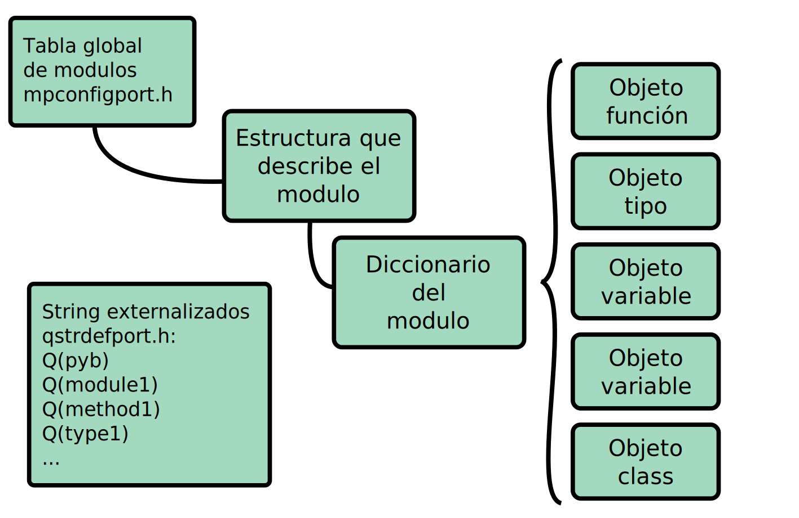

<!-- $theme: gaia -->

## ==Micropython en EDU-CIAA==
# 
# 
#### ==By Martin Ribelotta==
###### ==Emtech S.A.==

----

### ==¿šQue es micropython?==

 - Interprete de Python ligero y minimalista
 - Pensado para microcontroladores
 - Orientado a tiempo real y control
 - No requiere sistema operativo

----
## Diferencias entre CPython y Micropython

----

|                |     CPython       |    Micropython    |
|---------------:|:------------------|:------------------|
| Memoria Minima | 1...5MB           |  2K...8K          |
| Con pilas      | 30M...XGB         |  32K...64K        |
| Plataformas    | OS Unix, Win, ... | Sin sistema operativo|
| Librerias      | Red, analisis numerico, templates, IA | Control de motores, IoT, procesamiento de se単al, redes industriales |

----
### ==¿Que es EDU-CIAA?==

  - Parte del proyecto CIAA
  - `CIAA` *Computadora Industrial Abierta Argentina*
  - Desarrollo colectivo de hardware libre
  - Pensado para la industria
  - Con versiones educativas para escuelas y universidades
  - $EDU + CIAA =$ CIAA Educativa

----
###### ==EDU-CIAA-NXP==
### 

----

###### ==EDU-CIAA-NXP==
### 

----

###### ==Entrono de desarrollo uPyIDE==
### 
----

### ==Entrono de desarrollo terminal serial==
#### `screen /dev/ttyUSB1 115200`
# 

----
### ==Micropython EDU-CIAA==
#### Ejemplo:
```python
import pyb

led1 = pyb.LED(1);

def main():
    led1.on();
    pyb.delay(100);
    led1.off();
    pyb.delay(200);

main()
```

----
### ==Micropython EDU-CIAA==
#### Ejemplo:
```python
import pyb

switch, endsw = pyb.Switch(1), pyb.Switch(2)
r, g, b = pyb.LED(4), pyb.LED(5), pyb.LED(6)


def run_loop(leds=(r, g, b)):
    print('Loop started...')
    while not endsw.switch():
        if switch.switch():
            [led.on() for led in leds]
        else:
            [led.off() for led in leds]

>>> run_loop();
```

----
### ==Micropython EDU-CIAA==
#### Ejemplo:
```python
def meditor(filename):
    print("+ line <-- append line to file")
    print("blank line end edit")
    with open(filename, 'at') as f:
        while True:
            text = input("EDIT: ")
            if text:
                f.write(text)
                f.write('\n')
            else:
                break
    print("End editor")

>>> meditor('test1.txt')
```

----
### ==Micropython EDU-CIAA==
#### Ejemplo:
```python
import pyb

noise = pyb.ADC(1)
end_sw = pyb.Switch(1)

while not end_sw.switch():
    print(noise.read())
    pyb.delay(100)
print("Terminado")
```

----
### ==Micropython en EDU-CIAA==
## 

----
###### ==LPC4337==
### 

----
#### ==Estructura de carpetas==

```text
/-
 +- ciaa-nxp
 |   +- board_ciaa_edu_4337: Board HAL
 |   +- lpc_chip_43xx: SoC HAL
 |   +- frozen: Modulos python frozen
 |   +- py: Flash filesystem dir
 |   +- testing: Test sinteticos
 |   +- main.c: Entry point
 |   +- mod*.c: Modulos en C
 |   +- mpconfigport.h: Configuracion del port
 |   `- *.c|*.h: Otros archivos de soporte
 +- py: Codigo del interprete/compilador
 +- drivers: Drivers independientes de la plataforma
 +- lib: Librerias de soporte (readline, fatfs, etc.)
 `- <otros>: Otras plataformas

```

----

### ==Mapa de memoria==
## 

----
#### ==main.c simplificado==
```c
int main(int argc, char **argv) {
    memset(HEAP_START, 0, HEAP_SIZE); /* Heap init   */
    gc_init(HEAP_START, HEAP_END);    /* gc init     */
    mp_init();                        /* system init */
    mp_hal_init();                    /* drivers+hal */
    init_flash_fs();                  /* flash fs    */

    /* Try to execute main.py fron flash filesystem  */
    if (!pyexec_file("/flash/Main.py"))
        error("\nMain.py not found\n");

    for (;;)       /* Infinite loop. CTRL+C break it */
        if (pyexec_friendly_repl() != 0)
            break;

    system_reset(); /* System reset (main not return) */
}
```

----
###### ==mod*.c==



----

##### ==Estructura de un modulo mod*.c==

###### Definicion del modulo utimer
```c
STATIC const mp_map_elem_t time_module_globals_table[] = {
    { MP_OBJ_NEW_QSTR(MP_QSTR___name__),
      MP_OBJ_NEW_QSTR(MP_QSTR_utime) },
    { MP_OBJ_NEW_QSTR(MP_QSTR_sleep),
      (mp_obj_t)&time_sleep_obj },
      /* Otras entradas en el modulo */
};

STATIC MP_DEFINE_CONST_DICT(time_module_globals,
	time_module_globals_table);

const mp_obj_module_t mp_module_utime = {
    .base = { &mp_type_module }, /* tipo modulo */
    .name = MP_QSTR_utime,
    .globals = (mp_obj_dict_t*)&time_module_globals,
}
```

----

#### ==Estructura de un modulo mod*.c==

##### Definicion del modulo utimer
###### Metodo Time.sleep
```c
STATIC mp_obj_t time_sleep(mp_obj_t seconds_o) {
    if (MP_OBJ_IS_INT(seconds_o)) {
      mp_hal_milli_delay(1000 *
        mp_obj_get_int(seconds_o));
    } else {
      mp_hal_milli_delay(
        (uint32_t)(1000 * mp_obj_get_float(seconds_o)));
    }
    return mp_const_none;
}
MP_DEFINE_CONST_FUN_OBJ_1(time_sleep_obj, time_sleep);
```

----
##### ==Capacidades==
###### AKA: trabajo hecho

* Python3: uos, uhash, ujson, uzlib, ustruct
* Storage: EEPROM, Flash filesystem
* IO basica: GPIOs, LEDS, Switchs
* IO Avanzada: Teclado matricial, LCD Texto
* Analogico: ADC y DAC
* Comunicaciones: RS232, RS485, I2C, SPI
* Temporizacion: Timers, PWM, RTC

----
##### ==Faltantes==
###### AKA: queda por hacer
* Python3: Sincronizar con la ultima version
* Storage: SD/flash externa, puntos de montaje
* Comunicacion: Ethernet, profibus, canbus
* Control: PID, FIR, FFT, Stepper motor, Servo
* IO Avanzada: LCD graficos
* Modulos extra: Bluethoot, WiFi, LoRa, etc
* Milticore: Offload a Cortex-M0
###### ==Se buscan colaboradores!!!!!==

----

## ==Colaboradores y Agradecimientos==

* Damien George creador de micropython
* Ing. Ernesto Gigliotti colaborador quien realizó la mayoria de las librerias
* Ing. Pablo Ridolfi coordinador del proyecto CIAA
* Dr. Ing. Ariel Lutenberg anterior coordinador e impulsor del proyecto CIAA
* Emtech S.A. que apoya continuamente los proyectos personales de sus empleados.
* A los asistentes a la charla y futuros colaboradores
